# WEBSITE BÁN THUỐC ĐÔNG DƯỢC

## Lịch trình

| STT | Ngày       | Nội dung thực hiện                                                          | Ghi chú                                                                                                                                                             |
| --- | ---------- | --------------------------------------------------------------------------- | ------------------------------------------------------------------------------------------------------------------------------------------------------------------- |
| 2   | 25-8-2025  | Khởi tạo dự án, thiết lập CORS cho backend để làm việc với frontend         |                                                                                                                                                                     |
| 3   | 27-8-2025  | Thiết lập cấu hình cho backend, kết nối với cơ sở dữ liệu                   | Cài đặt cách thư viện ban đầu cần thiết, cấu hình ORM để làm việc với cơ sở dữ liệu                                                                                 |
| 4   | 29-8-2025  | Xây dựng module Users                                                       | Xây dựng Users controller, User entity, các DTO để làm việc với User                                                                                                |
| 5   | 30-8-2025  | Xây dựng module Auth                                                        | Xây dựng Auth controller, Auth entity, các DTO để làm việc với Auth                                                                                                 |
| 6   | 05-9-2025  | Xây dựng module Media                                                       | Xây dựng Media controller, Media entity, các DTO để làm việc với Media                                                                                              |
| 7   | 06-9-2025  | Liên kế Users với Media                                                     | Liên kết bảng Media và User để xây dựng API ảnh đại diện và ảnh bìa                                                                                                 |
| 8   | 08-9-2025  | Xây dựng tính năng đăng ký/đăng nhập local và Google, sử dựng JWT, Cookie   | Đăng ký/đăng nhập bằng local, Google, lưu trữ tài khoản người dùng vào CSDL, cơ chế xác thực/đăng nhập bằng JWT, lưu trữ token vào Cookie (yêu cầu từ phía backend) |
| 9   | 10-9-2025  | Xây dựng tính năng đăng ký/đăng nhập bằng Github                            |                                                                                                                                                                     |
| 10  | 11-9-2025  | Xây dựng cơ chế phân quyền                                                  | Phân quyền cho API bằng thuộc tính role trong Entity của User                                                                                                       |
| 11  | 11-9-2025  | Xây dựng module Categories                                                  | Xây dựng Categories controller, Category entity, các DTO để làm việc với Category                                                                                   |
| 12  | 15-9-2025  | Xây dựng module Products                                                    | Xây dựng Products controller, Product entity, các DTO để làm việc với Product                                                                                       |
| 13  | 17-9-2025  | Xây dựng cơ chế phân quyền Public                                           | Phân quyền Public khi không đăng nhập                                                                                                                               |
| 14  | 17-9-2025  | Xây dựng module Carts                                                       | Xây dựng Carts controller, Cart entity, các DTO để làm việc với Cart                                                                                                |
| 15  | 23-9-2025  | Xây dựng module CartItems                                                   | Xây dựng CartItems controller, CartItem entity, các DTO để làm việc với CartItem                                                                                    |
| 16  | 23-9-2025  | Xây dựng module Orders và OrderItems                                        | Xây dựng Orders và OrderItems controller, Order và OrderItem entity, các DTO để làm việc với Order và OrderItem                                                     |
| 17  | 29-9-2025  | Thiết lập cấu hình cho frontend                                             | Cài đặt cách thư viện ban đầu cần thiết, cấu hình phông chữ, tải một số ảnh tĩnh cần thiết cho việc xây dựng giao diện                                              |
| 18  | 30-9-2025  | Xây dựng những thành phần chung cho trang web                               | Xây dựng các thành phần chung như header, navbar, logo, footer                                                                                                      |
| 19  | 30-9-2025  | Xây dựng Trang chủ cho trang web                                            |                                                                                                                                                                     |
| 20  | 01-10-2025 | Thiết lập thư viện làm việc với API bên phía backend                        |                                                                                                                                                                     |
| 21  | 02-10-2025 | Xây dựng trang Đăng ký/đăng nhập và xây dựng duy trình trạng thái đăng nhập | Xây dựng trang và sử dụng API đăng ký/đăng nhập từ Auth API từ phía backend                                                                                         |
| 22  | 02-10-2025 | Xây dựng trang Sản phẩm                                                     | Xây dựng trang và sử dụng API của Products API và Categories API                                                                                                    |
| 23  | 03-10-2025 | Xây dựng trang Giới thiệu                                                   |                                                                                                                                                                     |
| 24  | 04-10-2025 | Xây dựng trang Thông tin người dùng                                         | Xây dựng trang và sử dụng API từ Users API từ phía backend                                                                                                          |
| 25  | 06-10-2025 | Xây dựng trang Liên hệ                                                      |                                                                                                                                                                     |
| 26  | 06-10-2025 | Xây dựng trang chi tiết Sản phẩm                                            | Xây dựng trang và sử dụng API của Products API và Categories API                                                                                                    |
| 27  | 10-10-2025 | Cài đặt và thiết lập Trình quản lý trạng thái cho trang web                 | Cài đặt Trình quản lý trạng thái (State Management) - Zustand                                                                                                       |
| 28  | 10-10-2025 | Xây dựng trang Giỏ hàng                                                     | Xây dựng trang và sử dụng API quản lý giỏ hàng từ Carts API từ phía backend                                                                                         |
| 29  | 12-10-2025 | Xây dựng trang Đặt hàng                                                     | Xây dựng trang và sử dụng API đặt sản phẩm trong giỏ hàng từ Orders API từ phía backend                                                                             |
| 30  | 14-10-2025 | Xây dựng trang Đơn mua                                                      | Xây dựng trang và sử dụng API từ Orders API từ phía backend để hiển thị cách sản phẩm đã đặt và các sản phẩm đã huỷ                                                 |
| 31  | 16-10-2025 | Xây dựng trang Quản trị                                                     |                                                                                                                                                                     |

## Công việc cần làm

- Frontend
  - Khách hàng
    - [x] Trang chủ
    - [x] Trang Sản phẩm
    - [x] Trang chi tiết sản phẩm
    - [x] Trang Thông tin người dùng
    - [x] Trang Giỏ hàng
    - [x] Trang Đơn mua
    - [x] Trang Chi tiết đơn hàng đã đặt
    - [ ] ...
  - Quản trị:
    - [ ] Trang tổng quan
    - [ ] Trang quản lý người dùng
    - [ ] Trang quản lý sản phẩm
    - [ ] Trang quản lý giỏ hàng
    - [ ] Trang quản lý đơn hàng
    - [ ] Trang quản lý đơn hàng đã đặt
    - [ ] Trang quản lý sản phẩm đã huỷ
    - [ ] Trang quản lý danh mục sản phẩm
    - [ ] ...

- Backend
  - Modules
    - [x] Users module
    - [x] Auth module
    - [x] Media module
    - [x] Categories module
    - [x] Products module
    - [x] Carts module
    - [x] CartItems module
    - [x] Orders module
    - [x] OrderItems module
    - [ ] ...
  - Chức năng chính
    - [x] Cơ chế phân quyền (Admin | Client | Public)
    - [x] Đăng ký/Đăng nhập (Local | Google | Github)
    - [x] Khởi tạo JWT, lưu trữ token vào cookie (access token và refresh token)
    - [x] Cơ chế xác thực JWT
    - [x] Lưu trữ ảnh của sản phẩm, ảnh category, ảnh người dùng
    - [ ] Xử lý ảnh khi vượt quá 6 bức cho Product
    - [ ] Xử lý khi ảnh vượt quá kích thước
    - [ ] Xử lý khi ảnh khi sai định dạng
    - [ ] ...

## I. CÔNG NGHỆ SỬ DỤNG

### 1. Ngôn ngữ lập trình: JavaScript / TypeScript

#### **JavaScript**

JavaScript là ngôn ngữ lập trình phổ biến nhất hiện nay, chủ yếu được sử dụng để phát triển các ứng dụng web trên nền tảng client-side và server-side. JavaScript cho phép xây dựng các giao diện tương tác, linh hoạt và có khả năng xử lý sự kiện trực tiếp trên trình duyệt.

```js
let a = 1;
```

**Đặc điểm nổi bật:**

- Hỗ trợ mô hình **event-driven** và **non-blocking I/O**, phù hợp cho ứng dụng thời gian thực.
- Có **hệ sinh thái phong phú (npm)** với nhiều thư viện và framework hỗ trợ.
- Dễ học, dễ tích hợp và được hỗ trợ bởi hầu hết các trình duyệt hiện nay.

#### **TypeScript**

TypeScript là phiên bản mở rộng của JavaScript, được phát triển bởi Microsoft, bổ sung tính năng **kiểm tra kiểu tĩnh (static typing)** và **hỗ trợ lập trình hướng đối tượng**.

```ts
let a: number = 1;
```

**Đặc điểm nổi bật:**

- Giúp phát hiện lỗi trong quá trình biên dịch, giảm thiểu lỗi runtime.
- Cải thiện khả năng bảo trì và mở rộng đối với các dự án lớn.
- Tích hợp tốt với các framework hiện đại như **Next.js** và **Nest.js**.

---

### 2. Frontend: Next.js

**Next.js** là một framework mạnh mẽ dựa trên **React**, được phát triển bởi **Vercel**, dùng để xây dựng các ứng dụng web hiện đại, hiệu năng cao và thân thiện với SEO.

**Công nghệ nền tảng:**

- **React.js:** Thư viện JavaScript dùng để xây dựng giao diện người dùng (UI) thông qua các **component** có thể tái sử dụng.
- **Node.js:** Nền tảng chạy JavaScript phía server, giúp Next.js thực hiện **Server-Side Rendering (SSR)** và xử lý logic phía backend.
- **Webpack / Turbopack:** Công cụ **bundler** và **compiler** giúp tối ưu, đóng gói mã nguồn, tăng tốc độ build và load trang.
- **Babel:** Trình biên dịch JavaScript, giúp chuyển mã ES6/ESNext sang phiên bản tương thích với trình duyệt.
- **TypeScript:** Giúp định nghĩa kiểu dữ liệu, tăng tính an toàn và dễ bảo trì khi phát triển ứng dụng lớn.

---

### 3. Backend: Nest.js

**Nest.js** là framework backend mạnh mẽ được xây dựng trên nền **Node.js** và viết hoàn toàn bằng **TypeScript**. Framework này áp dụng kiến trúc **modular** và **dependency injection**, giúp tổ chức mã nguồn rõ ràng, dễ bảo trì.

**Đặc điểm nổi bật:**

- Hỗ trợ nhiều mô hình phát triển như **REST API**, **GraphQL**, **WebSockets**, và **Microservices**.
- Kiến trúc hướng module, dễ mở rộng và tái sử dụng.
- Tích hợp tốt với cơ sở dữ liệu thông qua các ORM như **TypeORM**, **Prisma**, hoặc **Sequelize**.

---

### 4. Database: PostgreSQL

**PostgreSQL** là hệ quản trị cơ sở dữ liệu quan hệ (RDBMS) mã nguồn mở mạnh mẽ, đáng tin cậy và có khả năng mở rộng cao.

**Đặc điểm nổi bật:**

- Tuân thủ **chuẩn SQL** và hỗ trợ các kiểu dữ liệu nâng cao như **JSON**, **ARRAY**, **HSTORE**.
- Đảm bảo **tính toàn vẹn dữ liệu (ACID)**, an toàn và bảo mật cao.
- Hiệu năng tốt, phù hợp với các ứng dụng web có lượng dữ liệu lớn.

## II. Xây dựng website

### 1. Module backend: Nest.js

```mermaid
graph TD
    A[App Module] --> B[Users Module]
    A --> C[Auth Module]
    A --> D[Media Module]
    A --> E[Products Module]
    A --> F[Categories Module]
    A --> G[Carts Module]
    A --> H[CartItems Module]
    A --> I[Orders Module]
    A --> J[OrderItems Module]

    B --> B1[Users Controller]
    B --> B2[Users Service]

    C --> C1[Auth Controller]
    C --> C2[Auth Service]

    D --> D1[Category Media Controller]
    D --> D2[User Media Controller]
    D --> D3[Product Media Controller]

    D --> D4[Category Media Service]
    D --> D5[User Media Service]
    D --> D6[Product Media Service]

    E --> E1[Products Controller]
    E --> E2[Products Service]

    F --> F1[Categories Controller]
    F --> F2[Categories Service]

    G --> G1[Carts Controller]
    G --> G2[Carts Service]

    H --> H1[CartItems Controller]
    H --> H2[CartItems Service]

    I --> I1[Orders Controller]
    I --> I2[Orders Service]

    J --> J1[OrderItems Controller]
    J --> J2[OrderItems Service]
```


